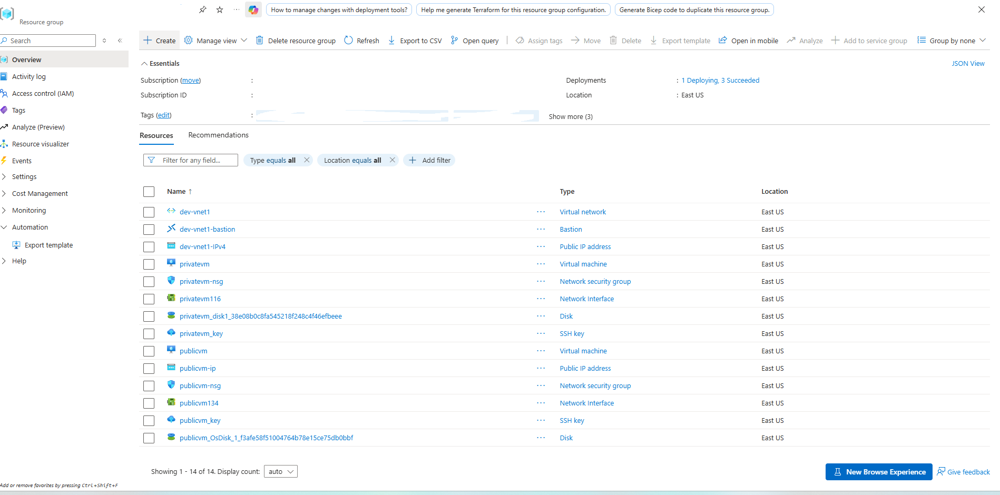
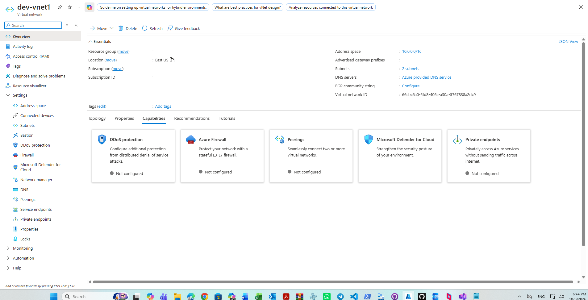
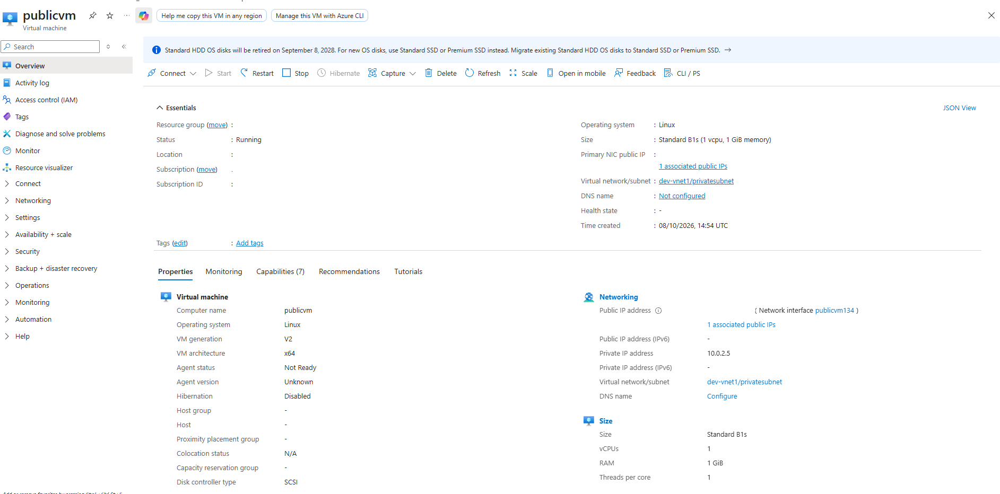
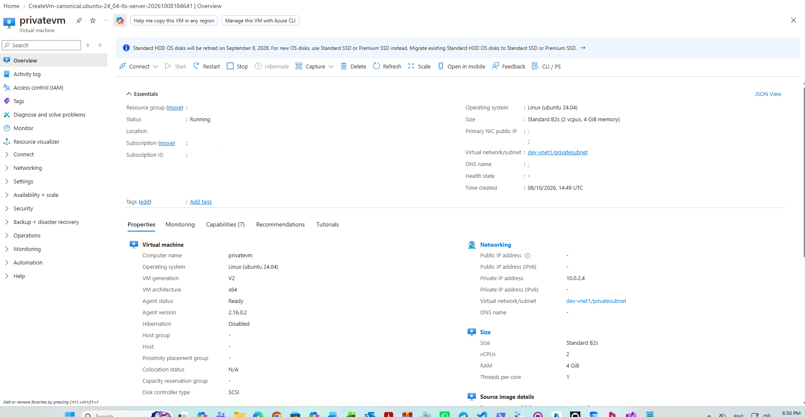
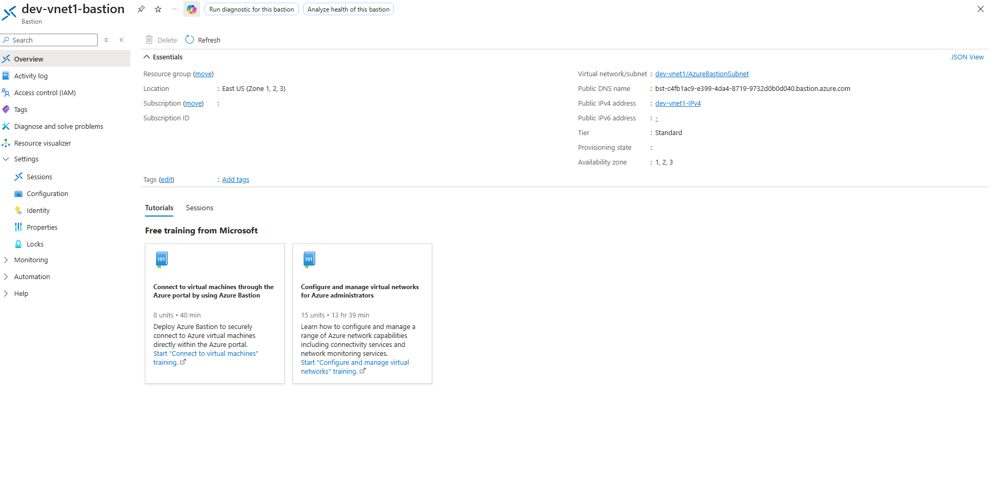
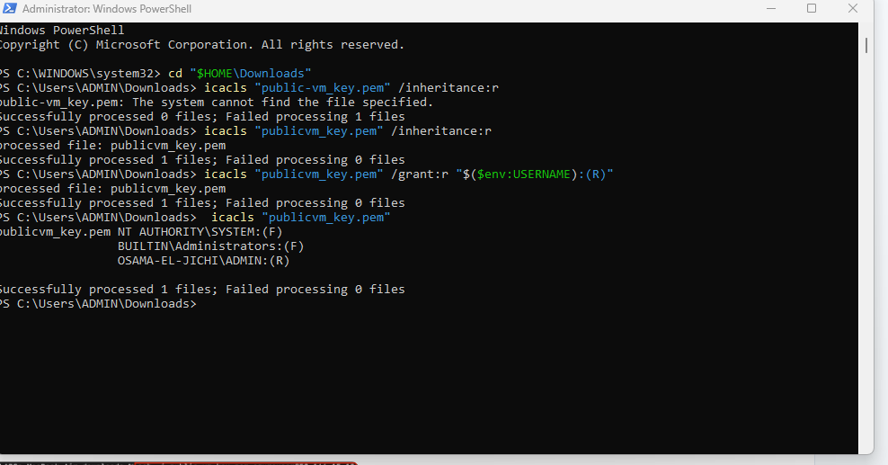
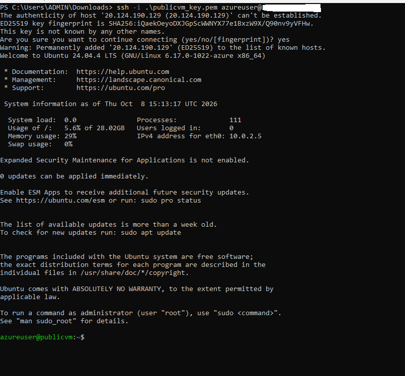
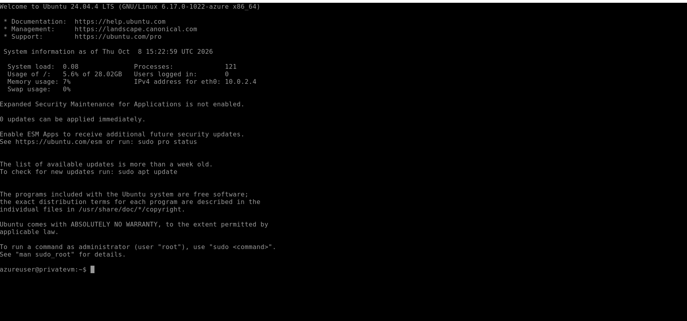

# Azure Virtual Network Architecture with Public and Private Access Workloads

Enterprise documentation detailing the provisioning of a segmented Azure Virtual Network topology in the East US region, containing dedicated public, private, and management subnets. The architecture implements an Internet-facing Linux virtual machine accessible via SSH, an isolated private virtual machine devoid of public IP routing, and seamless administrative access brokered via Azure Bastion.

---

## 1. Architecture & Provisioned Resources

### Core Infrastructure Topology

| Resource | Resource Name | Specification / Sizing | Region |
| :--- | :--- | :--- | :--- |
| **Virtual Network** | `dev-vnet1` | Address Space: `10.0.0.0/16` (3 Subnets) | East US |
| **Public Subnet** | `publicsubnet` | CIDR: `10.0.1.0/24` | East US |
| **Private Subnet** | `privatesubnet` | CIDR: `10.0.2.0/24` | East US |
| **Bastion Subnet** | `AzureBastionSubnet` | CIDR: `10.0.3.0/26` | East US |
| **Public Compute** | `publicvm` | Standard B1s (1 vCPU, 1 GiB RAM), Ubuntu 24.04 LTS | East US |
| **Private Compute** | `privatevm` | Standard B2s (2 vCPUs, 4 GiB RAM), Ubuntu 24.04 LTS | East US |
| **Azure Bastion** | `dev-vnet1-bastion` | Standard Tier, Zones: 1, 2, 3 | East US |
| **Bastion Public IP** | `dev-vnet1-IPv4` | Static Standard IPv4 (`172.212.17.175`) | East US |
| **VM Public IP** | `publicvm-ip` | Static Standard IPv4 (`20.124.190.129`) | East US |

---

### Provisioned Environment Validation

*Resource group overview confirming the deployment of virtual machines, networking subnets, security groups, SSH keys, and Azure Bastion.*

---

## 2. Step-by-Step Implementation

### Step 1: Virtual Network & Subnet Segmentation

Configured `dev-vnet1` with an overall address space of `10.0.0.0/16` and carved out dedicated network boundaries for public ingress, isolated database/compute tiers, and managed gateway services.

* **Virtual Network Name:** `dev-vnet1`
* **Address Space:** `10.0.0.0/16`
* **Subnet Allocation:**
  * `publicsubnet` (`10.0.1.0/24`)
  * `privatesubnet` (`10.0.2.0/24`)
  * `AzureBastionSubnet` (`10.0.3.0/26`)

*Reviewing the essentials, address space, and capability metrics of dev-vnet1 in the Azure Portal.*

---

### Step 2: Deploy Public Virtual Machine

Provisioned `publicvm` running Ubuntu 24.04 LTS equipped with a dedicated Network Interface (`publicvm134`), Network Security Group (`publicvm-nsg`) allowing inbound port 22, and assigned static public IPv4 address `20.124.190.129`.

* **Instance Name:** `publicvm`
* **Private IPv4 Address:** `10.0.2.5`
* **Public IPv4 Address:** `20.124.190.129`
* **Authentication:** SSH Public Key (`publicvm_key`)

*Validating the network settings, assigned public IP, and operational health of publicvm.*

---

### Step 3: Deploy Isolated Private Virtual Machine

Provisioned `privatevm` running Ubuntu 24.04 LTS inside the private subnet boundary without an associated public IP address. Ingress traffic is strictly controlled through `privatevm-nsg`.

* **Instance Name:** `privatevm`
* **Private IPv4 Address:** `10.0.2.4`
* **Public IPv4 Address:** None (Disassociated)
* **Authentication:** SSH Public Key (`privatevm_key`)

*Validating the configuration, private-only IP assignment, and status of privatevm.*

---

### Step 4: Configure Azure Bastion Host

Provisioned `dev-vnet1-bastion` within `AzureBastionSubnet` to provide browser-based, clientless management connectivity to internal subnets over TLS without exposing VM ports directly to the Internet.

* **Bastion Host Name:** `dev-vnet1-bastion`
* **Tier:** Standard (Scale units: 2)
* **Associated Public IP:** `dev-vnet1-IPv4` (`172.212.17.175`)
* **Availability Zones:** 1, 2, 3 (Zone-redundant)

*Confirming the active state, public DNS endpoint, and zone mapping of dev-vnet1-bastion.*

---

### Step 5: Adjust SSH Key Access Control Lists

Modified the file permissions of the downloaded SSH private key (`publicvm_key.pem`) in PowerShell using `icacls` to strip inherited security permissions and restrict access exclusively to the current administrative user.

* **Target File:** `publicvm_key.pem`
* **Inheritance Action:** Removed (`/inheritance:r`)
* **Explicit Grants:** Read access granted to current user context

*Configuring strict access control permissions on the private key file.*

---

### Step 6: Validate Direct SSH Ingress to Public VM

Established an interactive SSH session from the local workstation directly into `publicvm` via its assigned public IP address over TCP port 22, confirming operating system initialization and public accessibility.

* **Connection Target:** `azureuser@20.124.190.129`
* **Host Fingerprint Verification:** ED25519 key verified and accepted
* **Internal Network Interface:** `eth0: 10.0.2.5`

*Successful command-line authentication into publicvm using local SSH client.*

---

### Step 7: Validate Isolated Ingress via Azure Bastion

Initiated an administrative session targeting `privatevm` through Azure Bastion in the Azure Portal, establishing an authenticated shell to the private IP address `10.0.2.4` without public routing exposure.

* **Management Method:** Azure Bastion Native Browser Terminal
* **Internal IP Bound:** `eth0: 10.0.2.4`
* **Security Posture:** Zero public exposure, managed via private network path

*Active terminal session inside privatevm authenticated through Azure Bastion.*
